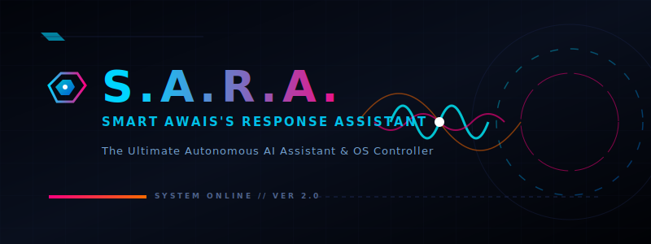
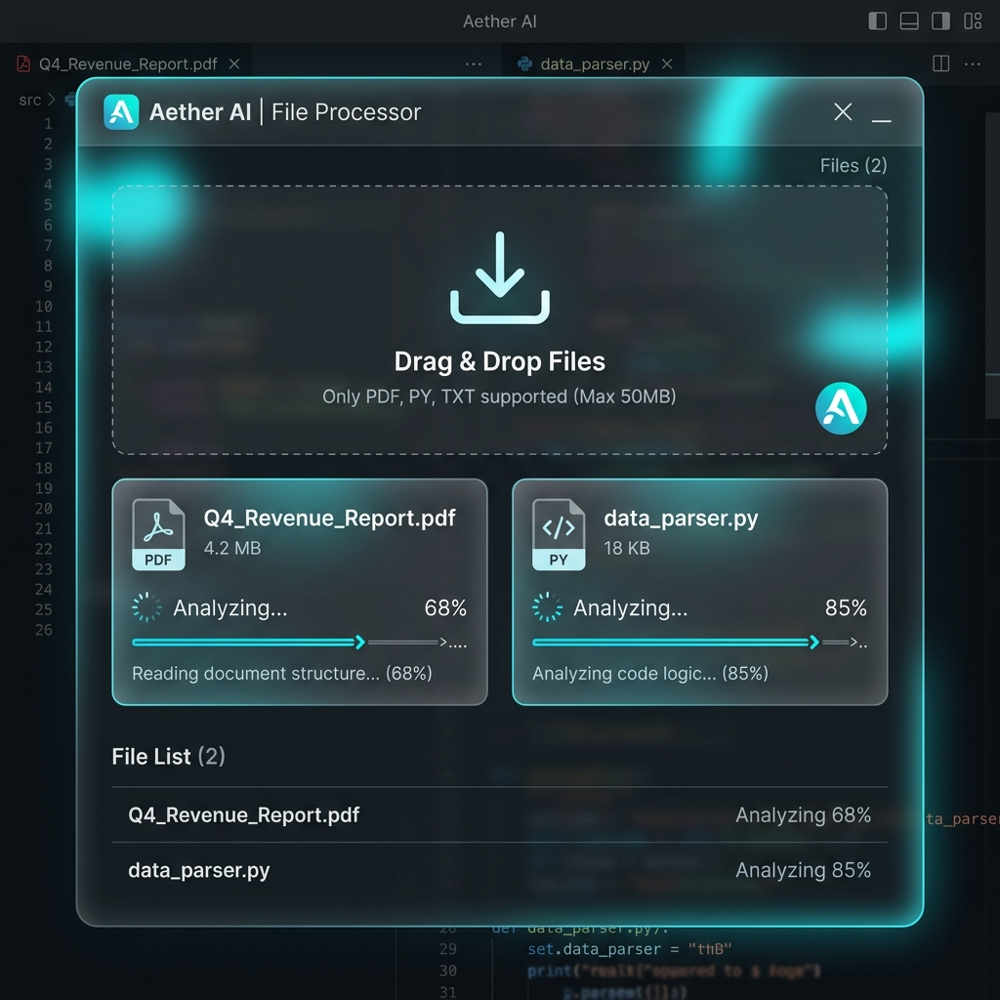
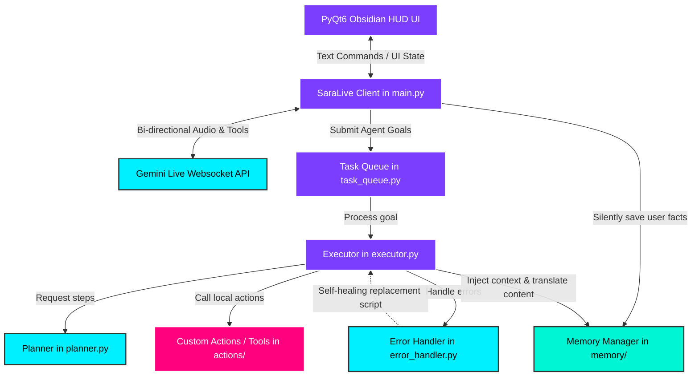

<p align="center">
  
</p>

# 🤖 S.A.R.A. (Smart Awais's Response Assistant)
### The Ultimate Autonomous AI Assistant & OS Controller — Developed by Mohammed Awais

<p align="center">
  
  
  
</p>

<p align="center">
  <a href="working%20behind/architecture_overview.md"></a>
</p>

**S.A.R.A.** is a real-time voice AI that can hear, see, understand, and control your computer — locally and with zero subscription costs. Built from the ground up to support Windows, macOS, and Linux, it represents a complete fusion of operating system control and language model autonomy.


*S.A.R.A.'s Sleek, futuristic, transparent HUD user interface featuring a cyberpunk hologram palette (cyan, pink, and orange).*

<p align="center"></p>

## ✨ Project Overview

S.A.R.A. is the culmination of the assistant series, engineered to bridge the gap between human voice/text commands and local system execution. Utilizing real-time audio streams, vision processing, and deep system API calls, S.A.R.A. is not just an assistant—it is an intelligent agent designed for complete digital autonomy.

<p align="center"></p>

## 🚀 Capabilities

### ⚡ Core Architecture & Features

| Feature | Description |
| :--- | :--- |
| **🎙️ Real-time Voice** | Ultra-low latency voice chat in any language utilizing native PCM audio stream |
| **🖥️ System Control** | Launch applications, manage files, edit code, and execute terminal commands |
| **🧩 Autonomous Task Execution** | Multi-step agentic planning and automatic tool fallback mechanisms |
| **👁️ Visual Awareness** | Captures and analyzes screen frames or camera feeds to act on visual cues |
| **🧠 Persistent Memory** | Automatically saves context, preferences, relationships, and workspace details |
| **⌨️ Hybrid Input** | Seamlessly swap between standard keyboard commands and fluid voice interaction |

<p align="center"></p>

## 🆕 Architecture Enhancements in S.A.R.A.

*   📂 **Advanced File Processing Engine** — Seamlessly drag and drop PDFs, source code, images, CSVs, or audio into the interface for instant analysis, transformation, or debugging.
*   🎨 **Sleek HUD User Interface** — A newly designed, highly responsive, transparent overlay that adapts dynamically to your desktop workspace.
*   🐧🍎 **Universal OS Compatibility** — Optimized path handling and window controllers for seamless stability across Windows, macOS, and Linux.
*   ⚡ **Low-Latency Inference** — Overhauled tool-calling pipeline and event loops to deliver immediate response speeds.


*A minimal, modern drag-and-drop file processing window for an AI assistant, showing a PDF and a code file being analyzed.*

<p align="center"></p>

## 🏛️ System Architecture & Dual-Loop Topology

S.A.R.A. is engineered using a **dual-loop architecture** designed to manage different classes of tasks concurrently:

1. **Interactive Real-Time Loop (Voice Mode):** Utilizes the Gemini Live API over WebSockets for low-latency voice, instant tool execution, and real-time screen/camera feed processing.
2. **Autonomous Background Loop (Agent Mode):** Utilizes a background task queue with self-healing, multi-step planning, execution, and verification pipelines for complex tasks (like building apps or solving code challenges).

### 🗺️ System Topology Diagram



### 🔀 Mode Comparison

| Feature | Voice Mode (Real-Time Live) | Agent Mode (Task Queue) |
| :--- | :--- | :--- |
| **Model** | `models/gemini-2.5-flash-native-audio-preview` | `models/gemini-2.5-flash` & `gemini-2.5-flash-lite` |
| **Trigger** | Speaking or typing a short message | Calling `agent_task` tool with a multi-step goal |
| **Flow** | Immediate, interactive feedback | Background queue execution |
| **Error Handling** | Speaks error, requests user direction | Auto-retries, replans, and writes self-healing scripts |
| **State** | Session-bound, saves memory flags | Produces file writes and saves research outputs directly to Desktop |

<p align="center"></p>

## 🛠️ Extensive Action Modules
S.A.R.A. is equipped with a comprehensive suite of action modules located in the `actions/` directory to handle diverse real-world tasks seamlessly:
*   🌐 **Browser & Web Search** — Navigate the web, perform complex queries, and compare information dynamically (`browser_control.py`, `web_search.py`).
*   💻 **Computer & Desktop Control** — Modify system settings, manage windows, use keyboard shortcuts, and manipulate files with high precision (`computer_settings.py`, `desktop.py`, `file_controller.py`).
*   🧑‍💻 **Code Helper & Dev Agent** — Get assistance with coding, debugging, and software development tasks directly in your workspace (`code_helper.py`, `dev_agent.py`).
*   📱 **Phone Control & Messaging** — Interact with connected mobile devices and dispatch messages across platforms (`phone_control.py`, `send_message.py`).
*   🎥 **Media & Screen Processing** — Control media playback and analyze screen contents through advanced vision capabilities (`screen_processor.py`).
*   🌦️ **Utility Actions** — Check weather reports, find flights, set reminders, and manage apps & games (`weather_report.py`, `flight_finder.py`, `reminder.py`, `open_app.py`, `game_updater.py`).

<p align="center"></p>

## ⚡ Complete Installation Guide

Follow these steps to fully install and run S.A.R.A. on your system.

### 📋 Prerequisites

| Parameter | Specification |
| :--- | :--- |
| **OS** | Windows 10/11, macOS, or Linux |
| **Python** | 3.11 or 3.12 (must be added to PATH) |
| **Hardware** | Microphone (required for voice-mode) |
| **API Keys** | Google Gemini API Key |

### 1. Clone & Set Up Directory
Clone the repository to your local machine and navigate into the project directory:
```bash
git clone https://github.com/Awais-17/SARA-Ai.git
cd SARA-Ai
```

### 2. Configure API Keys
1. Create a `config` folder in the root directory (if it doesn't already exist).
2. Inside `config`, create a file named `api_keys.json`.
3. Add your Gemini API key like so:
```json
{
  "gemini_api_key": "YOUR_API_KEY_HERE"
}
```

### 3. Install Dependencies
You can install all necessary packages automatically by running the included setup script:
```bash
python setup.py
```
*Alternatively, install them manually:*
```bash
pip install -r requirements.txt
playwright install
```
> 💡 **Tip:** The `playwright install` step is crucial for browser automation capabilities. If you encounter `ModuleNotFoundError` for certain system components, simply install the missing package via `pip install <module_name>` to match your specific operating system configuration.

### 4. Start the Assistant
Once everything is configured, start S.A.R.A. by running:
```bash
python main.py
```
*(On Windows, you can also double-click `start.bat` for convenience).*

<p align="center"></p>


<p align="center"></p>

## 👤 Developer & Architect

Engineered and designed by **Mohammed Awais**, building the future of S.A.R.A. assistant technology.

⭐ *Show your support for the journey toward S.A.R.A. v2!*
