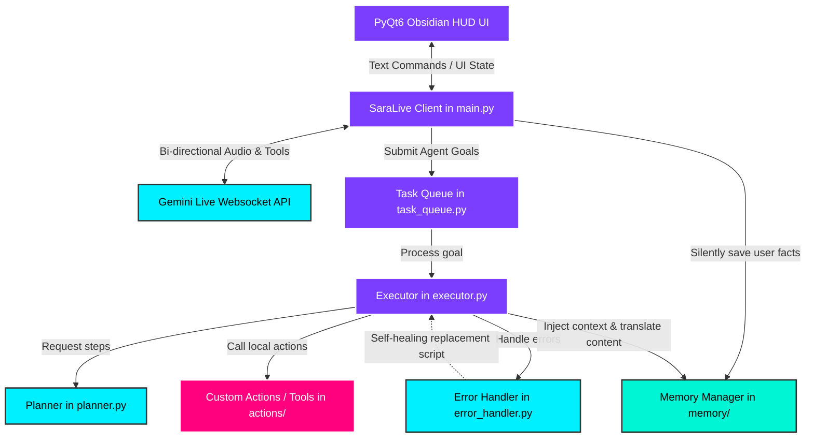
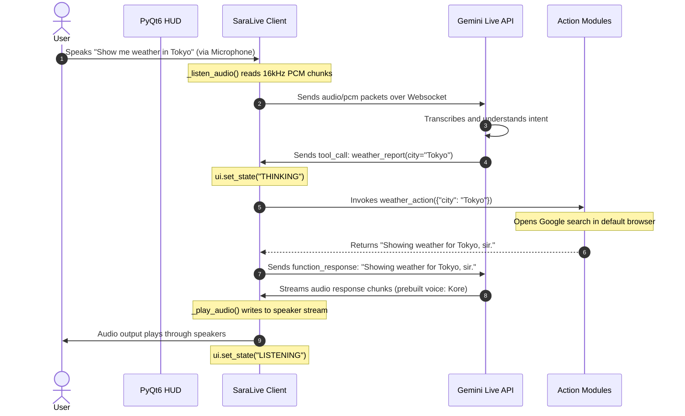

# 🏛️ S.A.R.A.: Architecture Overview

This document explains the high-level design of the S.A.R.A. System, illustrating how the user interface, real-time Gemini streaming engine, agent planner, and local action tools operate together.

---

## 🗺️ Architectural Topology

S.A.R.A. uses a **dual-loop architecture**:
1. **Interactive Real-Time Loop (Voice/Direct):** A low-latency Websocket connection with Gemini Live API for bidirectional voice streaming, screen frame capture, and immediate execution of single commands.
2. **Autonomous Background Loop (Agentic Queue):** A queue-based planning-execution-validation cycle for complex, multi-step tasks.

Here is a diagram representing the complete system layout:

---

## 🔄 Interaction Flows

### Flow 1: Live Voice Conversation & Tool Call
This diagram shows how a user's spoken command (e.g., *"Show me the weather in Tokyo"*) is captured, transcribed, routed to a tool, executed, and spoken back.

---

## 🧵 Threading & Async Model

To keep the UI responsive (avoid freezing) and allow audio recording and playback to occur simultaneously without stuttering, S.A.R.A. divides work across several threads and tasks:

1. **Main UI Thread:** 
   * Runs the PyQt6 `QMainWindow` and its render loops (60 FPS HUD animation).
   * Spawns the python backend thread during initialization.
2. **Python Runner Thread:**
   * Starts an asynchronous event loop (`asyncio.run()`) to handle all network tasks.
3. **Async Tasks (Event Loop tasks):**
   * `_send_realtime()`: Reads raw audio input from a queue and sends it to the Gemini Websocket.
   * `_listen_audio()`: Captures audio from the physical microphone using a callback, pushing byte buffers into a queue. Runs in coordination with the `sounddevice` input stream.
   * `_receive_audio()`: Listens for responses from the WebSocket. It processes text transcripts, plays audio packets, and handles tool calls.
   * `_play_audio()`: Feeds received raw PCM audio packets to `sounddevice.RawOutputStream`.
4. **Executor/Tool Threads:**
   * Because custom tool actions (like opening web browsers or launching local apps) are synchronous and blocking, the client runs them using `loop.run_in_executor(None, ...)` to delegate execution to a background thread pool, leaving the async networking loop free.

---

## 🔀 Voice Mode vs. Agent Mode

It is crucial to understand the difference between how S.A.R.A. runs simple commands vs. complex background tasks:

| Dimension | Voice Mode (Real-Time Live) | Agent Mode (Task Queue) |
| :--- | :--- | :--- |
| **Model** | `models/gemini-2.5-flash-native-audio-preview` | `models/gemini-2.5-flash` & `gemini-2.5-flash-lite` |
| **Initiated by** | Speaking or typing a short message | Calling `agent_task` tool with a multi-step goal |
| **Execution** | Immediate, step-by-step interactive feedback | Sequenced background queue execution |
| **Error Handling** | Speaks error, asks user what to do | Auto-retries, replans, and writes self-healing code scripts |
| **Persistence** | Session-bound, saves memory flags | Produces file writes and saves research outputs directly to Desktop |

> [!NOTE]
> When the Live client receives an `agent_task` command (e.g. *"Create a multi-file project for a todo app"*), it delegates it to the `TaskQueue` and returns a task ID. The background agent then takes over, letting you continue talking to S.A.R.A. while the build agent runs in the background.

---

## 🔍 Codebase Diagnostics
In [agent/error_handler.py](file:///c:/Users/mdawa/OneDrive/Desktop/Tuninig%20my%20ai/agent/error_handler.py#L70), there is a small syntax dependency on `API_CONFIG_PATH` which is not globally declared inside that specific file. It operates correctly when packaged/run, but is worth noting during modular testing.

---

**Next Steps to Study:**
* Learn how the audio stream connects over Websockets: **[2. Core Engine & Live Audio](file:///c:/Users/mdawa/OneDrive/Desktop/Tuninig%20my%20ai/working%20behind/core_engine_study.md)**
* Learn about the multi-step background planner: **[3. Agentic Planning, Execution & Self-Healing](file:///c:/Users/mdawa/OneDrive/Desktop/Tuninig%20my%20ai/working%20behind/agentic_system_study.md)**
