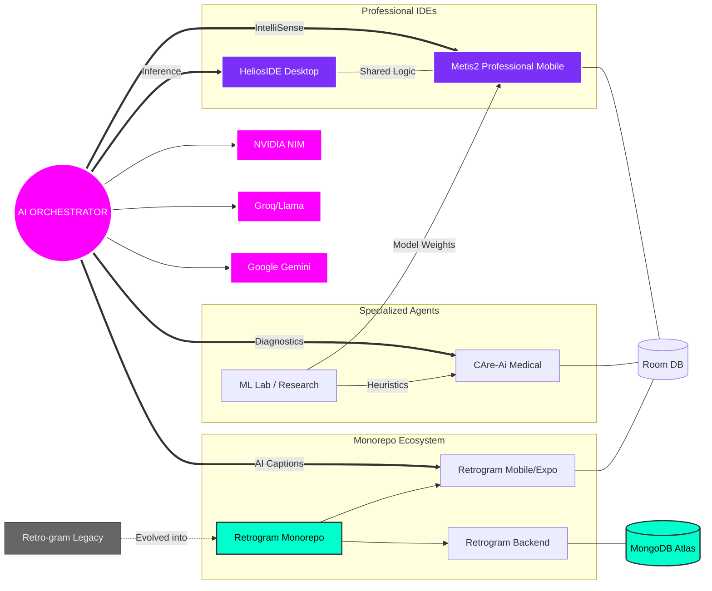

# Workspace Knowledge Graph & Architectural Analysis
**Generated on:** Sunday, May 31, 2026

## 1. Executive Architecture Summary
The workspace represents a highly sophisticated, AI-centric engineering footprint. The core focus is on **Agentic AI** and **Cross-Platform Tooling**. The "Neural Network" of projects identifies a unified philosophy: leveraging Large Language Models (LLMs) like Gemini, Groq, and NVIDIA NIM to provide intelligent assistance in specialized domains (Health, Education, and Development). The stack is modern and performant, utilizing **Electron/React** for desktop and **Kotlin/Jetpack Compose** for mobile, with a strong emphasis on offline execution (Chaquopy) and robust data persistence (Room, MongoDB).

---

## 2. Project Inventory

| Project Node | Status | Tech Stack | Strategic Purpose |
| :--- | :--- | :--- | :--- |
| **Retrogram (Monorepo)** | **Active / Evolved** | Node.js, Socket.io, Expo, TypeScript, MongoDB | A unified social platform featuring AI captions, Time Capsules, and Random Chat. |
| **Metis2 (Professional)** | **Active / High-Impact** | Kotlin, Monaco Editor, Chaquopy, NDK, Room | A "Mobile VS Code" targeting students without laptop access; supports offline Python/C++. |
| **HeliosIDE** | **Core Tool** | Electron, React, Groq, NVIDIA NIM | Primary AI Senior Engineer interface for desktop-based development. |
| **CAre-Ai** | **Production-Ready** | Jetpack Compose, Gemini, Groq, OSM Data | Award-winning medical triage and health monitoring application. |
| **ML Lab** | **Research** | Scikit-learn, Optuna, Pandas, Matplotlib | Research workspace for statistical modeling and hyperparameter tuning. |
| **Retro-gram (Old)** | **Legacy** | Node.js, Express (Standalone) | The original backend prototype now superseded by the monorepo structure. |

---

## 3. The Visual Knowledge Graph

---

## 4. Key Engineering Insights
1. **The LLM Fallback Pattern**: Both `HeliosIDE` and `CAre-Ai` implement a fallback mechanism (Groq → Gemini → NVIDIA NIM) for high availability.
2. **Successor Logic**: `Retrogram` (Monorepo) has fully absorbed the requirements of the older `Retro-gram` project, now using `Socket.IO` and `Expo`.
3. **The "Metis" Evolution**: `Metis2` represents an architectural jump from `Metis`, featuring SAF (Scoped Storage) and NDK toolchains for C/C++.
4. **Data Science Bridge**: The `ML Lab` protos algorithms and hyperparameter optimizations (Optuna) that are later integrated into mobile environments via `Chaquopy`.
5. **UI Consistency**: Clear aesthetic lineage ("Pure Black" & "Glassmorphism") across both Desktop and Mobile ecosystems.
